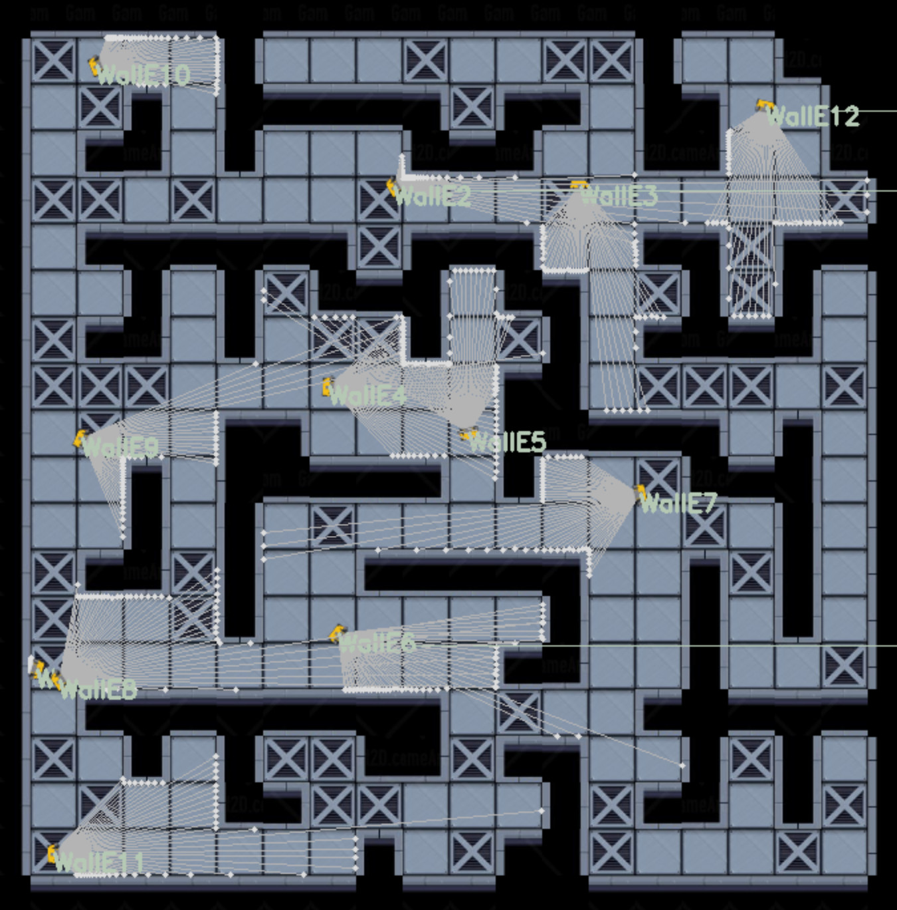
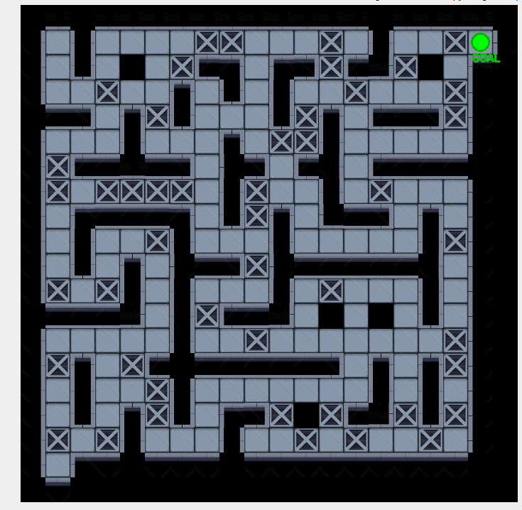
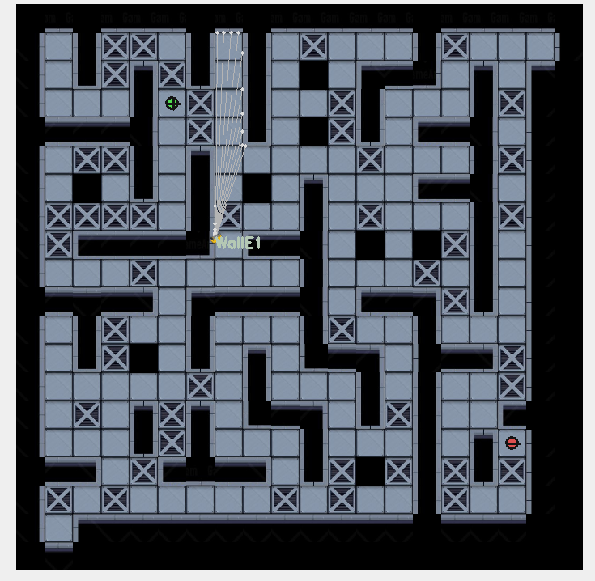

# Final project

Start with the repository: https://github.com/Tomeu7/robomaze/tree/ros2

## Repository Overview

This repository contains the ROS2 version of Robomaze: a 2D maze simulator where teams spawn robots, read lidar data, publish velocity commands, and race to navigate autonomously.

The simulator provides:
- Lidar (`/<name>/scan`)
- TF frames (`<name>_odom -> <name>_base_link`)
- Odometry (`/<name>/odom`)
- Optional goal/race tracking and optional speed powerups

Run/setup instructions are provided in the repository README.

## Screenshots

Main simulator view:


Goal visualization example:


Powerups visualization example:


## Your Task: Wall Follower

Create a ROS2 package with a node that:

1. Subscribes to `/<name>/scan` (LaserScan)
2. Publishes to `/<name>/cmd_vel` (Twist)
3. Implements a wall-following algorithm to navigate the maze

```bash
# Create your package
ros2 pkg create --build-type ament_python wall_follower
```

### Hints

- `msg.ranges` contains distance measurements from -45 to +45 degrees
- Ranges near index 0 are to the left, ranges near the end are to the right
- The center of the scan is straight ahead
- Use `linear.x` for forward speed, `angular.z` for turning

# Robomaze Final Project: Extra Features

## Baseline (all teams)

Every team must implement a **wall-follower node** that navigates a robot through a random maze autonomously. On race day, all teams run on the same random maze — fastest robot to reach the goal wins.

- Subscribe to `/<robot_name>/scan` (LaserScan)
- Publish to `/<robot_name>/cmd_vel` (Twist)
- Spawn your robot via `/create_robot`

### Final Day Test Plan

- On the final day, we will run a shared test with all robots together in the same simulation.
- The evaluation script used for this test will be shared 1 week before the final class.
- The final test maze will be randomly generated and larger than usual (approximately `50 x 50`).
- Powerups are currently being evaluated and may be included in the final setup.

---

## Extra Features (each team picks 2 or 1 in case its a big update. Also you can propose your own.)

Each extra must be demonstrated during the final presentation. Teams should pick features from **different sessions** if choosing two.

---

### Extra 1: TF2 and URDF Robot Model
**Related to: Session 2**

Build a URDF model for your maze robot and broadcast a proper TF tree.

**Requirements:**
- Create a URDF/Xacro file describing the robot (body, wheels, sensor mounts)
- Publish a full TF tree: `odom → base_link → laser_frame` (minimum), optionally add `camera_frame`, `imu_frame`
- Visualize the robot model and its TF frames in RViz2
- Use `robot_state_publisher` to broadcast the URDF transforms

**Deliverables:**
- URDF/Xacro file
- Launch file that starts `robot_state_publisher` alongside your wall follower
- RViz2 screenshot showing the robot model with TF frames

**Evaluation criteria:**
- Correct TF tree (no disconnected frames, proper parent-child relationships)
- URDF model has at least 3 links (body + 2 wheels or body + sensor mounts)
- Demonstrates understanding of coordinate frames

---

### Extra 2: Gazebo Migration
**Related to: Session 3**

Recreate the maze as a 3D Gazebo world and run your wall follower in it.

**Requirements:**
- Build a Gazebo world (SDF) that represents a maze (does not have to be the exact same maze)
- Create a robot model with a lidar sensor plugin in Gazebo
- Your wall-follower node must work in both the Robomaze simulator AND Gazebo without code changes (same topics)
- Write a launch file that starts Gazebo with the maze world and spawns the robot

**Deliverables:**
- Gazebo world file (`.sdf` or `.world`)
- Robot model with sensor plugins
- Launch file for the Gazebo setup
- Video or live demo of the robot navigating in Gazebo

**Evaluation criteria:**
- Maze world loads correctly in Gazebo
- Robot publishes `/scan` and subscribes to `/cmd_vel` via Gazebo plugins
- Same wall-follower code works in both simulators

---

### Extra 3: Camera + Computer Vision
**Related to: Session 4**

Add a camera to your robot and use OpenCV to detect visual markers placed in the maze.

**Requirements:**
- Subscribe to a camera topic (simulated or from Gazebo)
- Use OpenCV to detect ArUco markers or colored markers placed at specific locations in the maze
- When a marker is detected, publish its ID and the robot's position to a `/markers_found` topic
- The robot should log or report which markers it found during navigation

**Deliverables:**
- OpenCV detection node (separate from wall follower)
- Custom message or use `std_msgs/String` for marker reports
- Demo showing marker detection while navigating

**Evaluation criteria:**
- Correct detection of at least 3 markers
- Proper use of OpenCV (thresholding, contour detection, or ArUco library)
- Marker data is published as ROS2 messages

---

### Extra 4: IMU Sensor Fusion
**Related to: Session 4**

Add an IMU sensor to your robot and fuse it with odometry for more robust localization.

**Requirements:**
- Publish simulated `sensor_msgs/Imu` data (or use Gazebo IMU plugin)
- Implement a simple sensor fusion node (e.g., complementary filter or use `robot_localization` EKF)
- Compare raw odometry vs. fused odometry — show the difference
- Publish the fused pose on a separate topic

**Deliverables:**
- IMU publisher node (or Gazebo plugin config)
- Sensor fusion node
- RViz2 visualization showing both raw and fused odometry paths
- Brief report explaining the fusion approach

**Evaluation criteria:**
- IMU data is realistic (includes noise)
- Fusion output is demonstrably better than raw odometry
- Understanding of why sensor fusion matters

---

### Extra 5: IoT Dashboard with Rosbridge
**Related to: Session 5**

Build a web-based dashboard that shows the robot's state in real time.

**Requirements:**
- Set up `rosbridge_websocket` to expose ROS2 topics to a web client
- Build a web page (HTML + JavaScript) that connects to rosbridge and displays:
  - Robot position (live updating)
  - Robot speed
  - Laser scan visualization (simple 2D plot)
  - Goal status (reached or not, elapsed time)
- The dashboard must update in real time (at least 2 Hz)

**Deliverables:**
- Web dashboard (HTML/CSS/JS files)
- Launch file that starts rosbridge alongside the simulator
- Live demo of dashboard updating while the robot navigates

**Evaluation criteria:**
- Real-time updates (no manual refresh)
- At least 3 different pieces of data displayed
- Clean, readable interface

---

### Extra 6: MQTT IoT Gateway
**Related to: Session 5**

Bridge robot telemetry to an MQTT broker, simulating a real IoT device-to-cloud pipeline.

**Requirements:**
- Run an MQTT broker (Mosquitto or similar)
- Create a ROS2 node that subscribes to robot topics (odom, scan, goal status) and publishes them to MQTT topics
- Create a second subscriber (Python script, Node-RED, or web client) that reads from MQTT and displays/logs the data
- Demonstrate the full pipeline: Robot → ROS2 → MQTT → External client

**Deliverables:**
- MQTT bridge node
- MQTT subscriber/viewer (can be Node-RED flow, Python script, or web page)
- Architecture diagram showing the data flow
- Demo of the full pipeline

**Evaluation criteria:**
- Data flows correctly through the entire pipeline
- MQTT topics are well-structured (e.g., `robomaze/<robot_name>/position`)
- Demonstrates understanding of IoT gateway architecture

---

### Extra 7: LLM-Powered Race Commentary
**Related to: Session 5**

Use an LLM to generate real-time natural language commentary about the robot's progress.

**Requirements:**
- Create a ROS2 node that subscribes to robot telemetry (position, speed, goal status, collisions)
- Periodically send a summary of the robot's state to an LLM API (OpenAI, Anthropic, or local model)
- The LLM generates a short commentary (e.g., "WallE is making great progress, currently halfway through the maze and picking up speed!")
- Publish the commentary to a `/commentary` topic and/or display it on a dashboard

**Deliverables:**
- Commentary node with LLM integration
- Example output showing different commentary based on robot state
- Demo during the race

**Evaluation criteria:**
- Commentary is contextually relevant (not generic)
- Updates at reasonable intervals (every 5-10 seconds)
- Handles different situations (stuck, progressing, near goal, reached goal)

---

### Extra 8: Diagnostics and Monitoring
**Related to: Session 5**

Implement ROS2 diagnostics for the robot, simulating production-grade monitoring.

**Requirements:**
- Use `diagnostic_msgs/DiagnosticStatus` and `diagnostic_msgs/DiagnosticArray` to publish robot health
- Monitor at least 3 metrics: sensor status (is scan data flowing?), velocity (is robot stuck?), battery level (simulated, decreasing over time)
- Create a diagnostics aggregator node that sets warning/error levels based on thresholds
- Display diagnostics in `rqt_runtime_monitor` or a custom viewer

**Deliverables:**
- Diagnostics publisher node
- Configuration for diagnostic thresholds
- Demo showing different diagnostic states (OK, WARNING, ERROR)

**Evaluation criteria:**
- Proper use of `diagnostic_msgs` message types
- At least 3 monitored metrics with meaningful thresholds
- Diagnostics react to actual robot state (not hardcoded)
